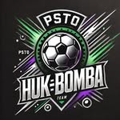

<!DOCTYPE html>
<html lang="pl">
<head>
  <meta charset="UTF-8" />
  <meta name="viewport" content="width=device-width, initial-scale=1" />
  <title>PSTO Huk Bomba</title>
  
</head>
<body>

  <header>
    
    <h1>PSTO Huk Bomba</h1>
    
🔥 "Z nami zawsze po bombie!"

  </header>

  <section>
    <h2>Skład drużyny</h2>
    
<strong>Pimpek (pomocnik):</strong> Mówi więcej niż biega. Wiecznie bez siły, bo „rzygał”. Jedyny z B-klasy.

    
<strong>Lichu (obrona/bramkarz):</strong> Brodaty profesor futbolu i prawa. Technika lepsza niż kodeks karny.

    
<strong>Szymon (ofensywny):</strong> Błyskawica z problemem celności – jak kopnie, to nie wiadomo gdzie piłka poleci.

    
<strong>Mati Miśki (ofensywny):</strong> Tricki? Próbuje. Skuteczność? Różnie. Ale atmosfera? 10/10.

    
<strong>Mati Kuchta (neutralny):</strong> Gra tylko jak się go uprosi. Znany z Tourana i niespodziewanych zagrań.

    
<strong>Julu (obrończyni):</strong> Zmuszana do gry, ale jak już zagra – ściana nie do przejścia. Twarda babka!

    
<strong>Pawełek (uniwersalny):</strong> Mały, ale wariat. Gra wszędzie i wszędzie dobrze.

  </section>

  <section>
    <h2>Pozycje na boisku</h2>
    <svg viewBox="0 0 300 500" width="150" height="250" aria-label="Boisko i pozycje graczy">
      <rect x="0" y="0" width="300" height="500" fill="#a8d08d"/>
      <line x1="0" y1="250" x2="300" y2="250" stroke="white" stroke-width="2"/>
      <circle cx="150" cy="250" r="30" stroke="white" stroke-width="2" fill="none"/>
      <circle cx="150" cy="250" r="2" fill="white"/>
      <text x="150" y="60" text-anchor="middle" fill="black" font-size="18">Lichu</text>
      <text x="80" y="200" text-anchor="middle" fill="black" font-size="14">Julu</text>
      <text x="220" y="200" text-anchor="middle" fill="black" font-size="14">Pimpek</text>
      <text x="80" y="300" text-anchor="middle" fill="black" font-size="14">Mati Miśki</text>
      <text x="220" y="300" text-anchor="middle" fill="black" font-size="14">Szymon</text>
      <text x="150" y="400" text-anchor="middle" fill="black" font-size="14">Pawełek</text>
      <text x="150" y="470" text-anchor="middle" fill="black" font-size="14">Kuchta</text>
    </svg>
  </section>

  <section>
    <h2>Zdjęcie drużynowe</h2>
    
  </section>

  <section>
    <h2>Wyniki meczów</h2>
    <table>
      <thead>
        <tr>
          <th>Kolejka</th>
          <th>Wynik</th>
        </tr>
      </thead>
      <tbody>
        <tr>
          <td>Kolejka 1</td>
          <td>PSTO Huk Bomba 8 - 10 Stary Żmigród</td>
        </tr>
        <tr>
          <td>Kolejka 2</td>
          <td>PSTO Huk Bomba 5 - 10 Stary Żmigród</td>
        </tr>
        <tr>
          <td>Puchar Korony Królów</td>
          <td>PSTO Huk Bomba 13 - 12 Stary Żmigród</td>
        </tr>
        <tr>
          <td>Kolejka 4</td>
          <td>PSTO Huk Bomba 9 - 8 Stary Żmigród</td>
        </tr>
      </tbody>
    </table>
  </section>

  <section>
    <h2>Kontakt</h2>
    <form action="mailto:lokatorzymojrzeszow@gmail.com" method="post" enctype="text/plain">
      <input type="text" name="name" placeholder="Twoje imię" required />
      <input type="email" name="email" placeholder="Twój email" required />
      <textarea name="message" placeholder="Wiadomość" rows="4" required></textarea>
      <input type="submit" value="Wyślij" />
    </form>
  </section>

  <section>
    <h2>Instagram</h2>
    
Obserwuj nas na <a href="https://www.instagram.com/psto_huk_bomba/" target="_blank" rel="noopener noreferrer">Instagramie</a>!

  </section>

  <section>
    <h2>Hasła Klubu</h2>
    <ul>
      <li>🔥 "Z nami zawsze po bombie!"</li>
      <li>⚽ "Więcej stylu niż skilla!"</li>
      <li>🚬 "Nie ważne jak grasz, ważne że z nami!"</li>
      <li>🍻 "Przegraliśmy? Ale przynajmniej był grill!"</li>
    </ul>
  </section>

  <footer>
    &copy; 2025 PSTO Huk Bomba – Wszystkie prawa zastrzeżone.
  </footer>

</body>
</html>
